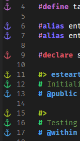

# เครื่องมือ

นี่เป็นเครื่องมือที่ผมแนะนำมันทำให้สะดวกสบายในการเขียนดาต้าแพ็ค
## โปรแกรม

1.ลง [VS Code](https://code.visualstudio.com/) หรือ [VS Code Insider](https://code.visualstudio.com/insiders/) หรือ [VS Codium](https://vscodium.com/) *ผมใช้ Insider

2.ติดตั้งส่วนขยาย
- [Data-pack Helper Plus](https://marketplace.visualstudio.com/items?itemName=SPGoding.datapack-language-server) สำหรับช่วยเขียนดาต้าแพ็ค

ตัวอย่างคร่าวๆ


- [language-mcfunction](https://marketplace.visualstudio.com/items?itemName=arcensoth.language-mcfunction) สำหรับไฮไลท์สีโค๊ดดาต้าแพ็คเพิ่มเติม
- [tellraw preview](https://marketplace.visualstudio.com/items?itemName=actuallyboomber.tellraw-preview) เอาไว้ดูตัวอย่างข้อความที่ส่งไปยังผู้เล่น


- [Comment Anchors](https://marketplace.visualstudio.com/items?itemName=ExodiusStudios.comment-anchors) เอาไว้ไฮไลท์คอมเม้นท์และมาร์กสีฟังก์ชั้น `#` ของ `Data-pack Helper Plus`



- [Material Icon Theme](https://marketplace.visualstudio.com/items?itemName=PKief.material-icon-theme) เปลี่ยนไอคอนไฟล์สวยๆ อันนี้แล้วแต่ความชอบ

## ตั้งค่า

ถ้าคุณเขียนดาต้าแพ็คแล้วอยากให้โค๊ดมีลักษณะสวยๆแบบนี้ หรือ ปรับแต่งได้ตามใจชอบ สามารถตั้งค่าได้ดังนี้


1.หลังจากโหลด Font และติดตั้งแล้ว ก็ตั้งค่า Font โดยไปที่ `Setting -> Text Editor -> Font -> Font Family ใส่ Fira Code`
- Font [Fira Code](https://github.com/tonsky/FiraCode) (แล้วแต่ความชอบด้วย ที่ผมใช้ Font นี้ส่วนนึงเพราะการเปลี่ยนรูปเครื่องหมาย `<=` `->` ดั่งในภาพ และ `@` มันเท่ห์ดี)
- Font Ligatures (เปลี่ยนรูปเครื่องหมาย `<=` `->`) -> `Edit in settings.json` -> `"editor.fontLigatures": true`

2.ไฮไลท์สี 
- จากข้อก่อนหน้าไม่ต้องปิดหน้าต่าง settings.json
- ให้คัดลอกนำไปใส่ได้เลย ( `,` จะต่อจาก `editor.fontLigatures": true`)
- อยากปรับแต่งเพิ่มเติม [ดูที่นี่](https://github.com/SPGoding/datapack-language-server/wiki/Semantic-Tokens)
```json
    ,
    "editor.semanticTokenColorCustomizations": {
        "enabled": true,
        "rules": {            
            "literal": "#ffffff",
            "*.firstArgument": "#c986c4",
            "*.declaration": {
                "fontStyle": "italic",
            },
            "identity": "#f1bf74",
            "operator": "#da4545",
            "boolean": "#bcdf6c",
            "property": "#81c0fa",
            "string": "#bcdf6c",
            "*.inString": {
                "fontStyle": ""
            },
            "type": "#ff6ec3",
            "variable": "#e19178",
            "vector": "#00ffffde",
        }
    },
    "workbench.colorCustomizations": {
        "statusBar.background": "#16825d",
        "statusBarItem.remoteBackground": "#3ea8ff"
    }
```
3.ไฮไลท์คอมเมนต์ (ใส่ หลังจาก `}` ในข้อ 2 ได้เลย )
```json
    ,
    "commentAnchors.tags.list": [   

        {
            "tag": "ANCHOR",
            "iconColor": "default",
            "highlightColor": "#A8C023",
            "scope": "file",
            "enabled": false
        },
        {
            "tag": "TODO",
            "iconColor": "blue",
            "highlightColor": "#3ea8ff",
            "scope": "file",
            "enabled": false
        },
        {
            "tag": "FIXME",
            "iconColor": "red",
            "highlightColor": "#F44336",
            "scope": "file",
            "enabled": false
        },
        {
            "tag": "STUB",
            "iconColor": "purple",
            "highlightColor": "#BA68C8",
            "scope": "file",
            "enabled": false
        },
        {
            "tag": "NOTE",
            "iconColor": "orange",
            "highlightColor": "#FFB300",
            "scope": "file",
            "enabled": false
        },
        {
            "tag": "REVIEW",
            "iconColor": "green",
            "highlightColor": "#64DD17",
            "scope": "file",
            "enabled": false
        },
        {
            "tag": "SECTION",
            "iconColor": "blurple",
            "highlightColor": "#896afc",
            "scope": "file",
            "behavior": "region",
            "enabled": false
        },
        {
            "tag": "LINK",
            "iconColor": "#2ecc71",
            "highlightColor": "#2ecc71",
            "scope": "file",
            "behavior": "link",
            "enabled": false
        },
        {
            "tag": "define",
            "highlightColor": "#BA68C8",
            "scope": "file",
            "isItalic": false
        },        
        {
            "tag": "alias",
            "highlightColor": "#7c6afb",
            "scope": "file",
            "isItalic": false,
        },
        {
            "tag": "declare",
            "highlightColor": "#d55462",
            "scope": "file",
            "isItalic": false,
        },
        {
            "tag": "#>",
            "highlightColor": "#A8C023",           
            "scope": "file",
            "isItalic": false
        },
        {
            "tag": "# @",
            "highlightColor": "#469fe3",
            "scope": "file",
            "isItalic": false
        },
        {
            "tag": "# ",
            "highlightColor": "#2ecc71",
            "scope": "file",
            "isItalic": false
        }
    ],
    "commentAnchors.tags.matchCase": false,
    "commentAnchors.tags.separators": [
        " - ",
        ": ",
        ""
    ]
```