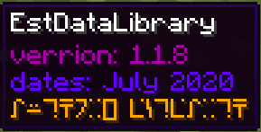

# เคล็ดลับไฟล์ pack.mcmeta

# เกี่ยวกับ

เป็นลูกเล่นที่คุณสามารถนำไปใช้ได้

# ใช้งานยังไง

ไฟล์ `pack.mcmeta` รองรับ JSON Text Component ด้วย
ซึ่งสามารถนำไปใช้กับ `advancement` ได้ด้วยนะ 

## แบบ ที่ 1

```json
{
	"pack": {
		"pack_format": 6,
		"description": [
			{
				"text": "verrion: 1.1.8\n",
				"color": "gold"
			},
			{
				"text": "dates: July 2020\n"
			},
			{
				"text": "author: EstEarth"
			}
		]
	}
}
```


ถ้าคุณใส่ `"description": ["",{` 2 บรรทัดล่างจะกลายเป็นสีค่าตั้งต้น


## แบบ ที่ 2

```json
{
    "pack": {
        "pack_format": 6,
        "description": [
            {
                "text": "verrion: 1.1.8\n",
                "color": "dark_purple"
            },
            {
                "text": "dates: July 2020\n",
                "color": "#6600ff"
            },
            {
                "text": "author: EstEarth",
				"color": "gold",
				"font": "alt"
            }
        ]
    }
}
```


สำหรับเกมเวอร์ชั่น 1.16 ขึ้นไป
คุณสามารถใช้ค่าสี *HEX* และ *Custom Font* ด้วย *Resource pack* ได้

## ตัวอย่างการใช้งานสำหรับ Advancement

```json
{
	"display": {
		"title": {
			"text": "      Est Clock Utility      ",
			"color": "yellow"
		},
		"description": [
			{
				"text": "Clock Day, ",
				"color": "green"
			},
			{
				"text": "Time, ",
				"color": "yellow"
			},
			{
				"text": "Weather, ",
				"color": "dark_aqua"
			},
			{
				"text": "Place characteristics, ",
				"color": "aqua"
			},
			{
				"text": "Moon, ",
				"color": "gray"
			},
			{
				"text": "Biomes",
				"color": "green"
			}
		],
		"icon": {
			"item": "minecraft:clock"
		},
		"announce_to_chat": false,
		"show_toast": false
	},
	"parent": "global:estearth",
	"criteria": {
		"trigger": {
			"trigger": "minecraft:tick"
		}
	}
}
```


## หมายเหตุ

`\n` มีหน้าที่ขึ้นบรรทัดใหม่ แนะนำให้ใส่ไว้ข้างหลังรูปแบบโค๊ดจะสวยกว่า ถ้าใส่ข้างหน้า `n` จะอยู่ติดกับอักษรอื่น